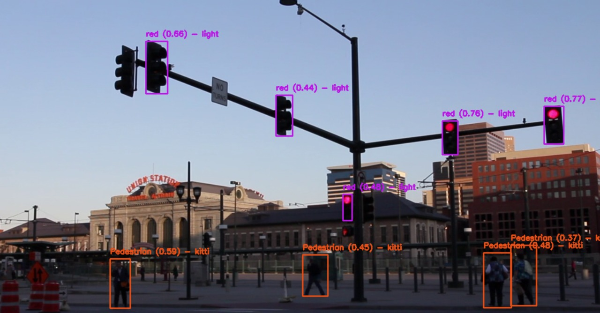

# 🚗 Autonomous Vehicle

Multi-model detection system for traffic objects using **YOLOv8 & YOL**

[](https://autonomous-vehicle.streamlit.app/)

---

## 🚀 Technologies Used

- **Core Framework**: Ultralytics YOLOv8  
- **Interface**: Streamlit  
- **Computer Vision**: OpenCV  
- **Experiment Tracking**: MLflow  
- **Image Processing**: PIL, Albumentations  
- **Utilities**: NumPy, Pandas, Tempfile  
- **Hardware Acceleration**: CUDA-enabled NVIDIA GPUs  

---

## 🔍 Key Features

✅ Multi-model object detection  
✅ Real-time processing for images, videos, and webcam  
✅ Interactive web interface with adjustable parameters  
✅ Per-class detection statistics  
✅ MLflow-based model performance tracking  
✅ Supports:
  - KITTI dataset objects
  - Traffic light state detection
  - Pothole identification
  - Traffic sign recognition

---

## 🖥️ How to Use

```python
import streamlit as st
from ultralytics import YOLO

# Initialize combined detector
model_paths = ['KITTI.pt', 'light.pt', 'pothole.pt', 'sign.pt']
detector = CombinedYOLODetector(model_paths)

# Streamlit interface
input_type = st.radio("Select Input Type", ["Image", "Video", "Webcam"])
conf_thresh = st.slider("Confidence Threshold", 0.1, 1.0, 0.25)
iou_thresh = st.slider("IOU Threshold", 0.1, 1.0, 0.45)

if input_type == "Image":
    uploaded_image = st.file_uploader("Upload image", type=["jpg", "png"])
    # (your processing logic here)
```

---

## ⚙️ Installation

```bash
git clone https://github.com/yourusername/autonomous-vehicle-perception.git
cd autonomous-vehicle-perception

# Install required packages
pip install -r requirements.txt

# Place model weights in project root
# ├── KITTI.pt
# ├── light.pt
# ├── pothole.pt
# └── sign.pt
```

---

## 📁 Dataset Preparation

Organize your datasets in YOLO format:

```
Yolo_Dataset/
├── images/
│   ├── train/
│   └── val/
└── labels/
    ├── train/
    └── val/
```

Create a `data.yaml` with your dataset paths and classes.

---

## 📊 Usage

```bash
streamlit run app.py
```

Then in the sidebar:

- Select detection models  
- Adjust confidence/IOU thresholds  
- Choose input type: Image / Video / Webcam  
- View real-time visualizations and performance metrics  

---

## 📈 Results

| 🧠 Detection Output | ⚡ Real-Time Inference |
|---------------------|------------------------|
|  |  |

---

## 🤝 Acknowledgements

This project was built collaboratively by:
- [**Hosam Emam**](https://github.com/Hosam-emam)
- [**Marceleno Ayman**](https://github.com/Leosce)
- [**Therese Sameh**](https://github.com/Theresee13)
- [**Omar ElMahy**](https://github.com/Elma7e)

- Special thanks to:
  - **_Digital Egypt Pioneering Initiative_**
  - Ultralytics for YOLOv8
  - KITTI Vision Benchmark Suite
  - LISA Traffic Light Dataset

---

## 📜 License

This project is licensed under the **MIT License** — see the [LICENSE](LICENSE) file for details.
